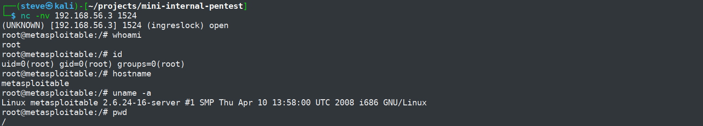
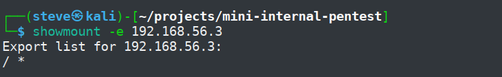
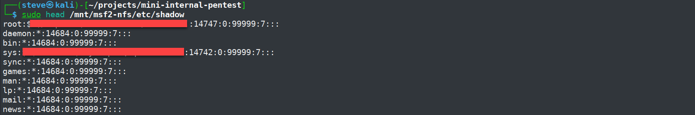
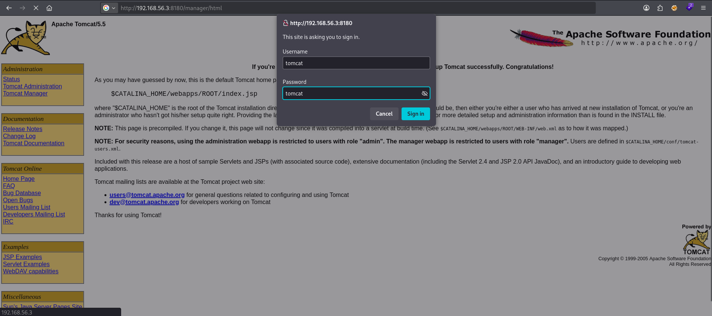
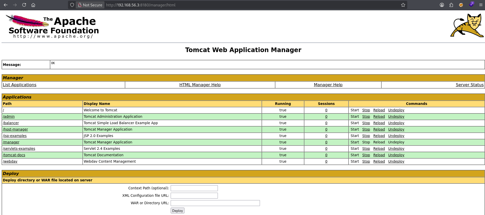

# Internal Penetration Testing Lab Report

**Prepared by:** Panhapich Khe  
**Assessment date:** 9 July 2026  
**Report version:** 1.0  
**Assessment type:** Internal penetration test  
**Environment:** Isolated VirtualBox lab  
**Target:** Metasploitable 2 (`192.168.56.3`)  

---

## 1. Executive Summary

This report documents an authorized internal penetration test conducted against a deliberately vulnerable Metasploitable 2 virtual machine in an isolated VirtualBox host-only network.

The purpose of the assessment was to practice a complete penetration-testing workflow, including service enumeration, vulnerability validation, impact analysis, evidence collection, risk classification, and remediation writing.

Three primary findings were confirmed:

| ID | Finding | Severity |
|---|---|---|
| F-01 | Unauthenticated Root Bind Shell | Critical |
| F-02 | NFS Root Filesystem and Shadow File Exposure | Critical |
| F-03 | Tomcat Manager Accessible with Default Credentials | High |

The target should be considered fully compromised. An unauthenticated remote user could obtain a root shell, access sensitive operating-system files through NFS, retrieve password hashes, and access the Tomcat Manager interface using default credentials.

The highest-priority actions are to remove the exposed bind shell, stop exporting the root filesystem through NFS, replace default credentials, restrict administrative services to trusted systems, and disable unnecessary services.

---

## 2. Scope

The assessment was limited to the following authorized target:

```text
192.168.56.3
```

The target was hosted inside an isolated VirtualBox host-only network.

No external, production, or third-party systems were tested.

### 2.1 In-Scope Activities

- Host connectivity validation
- TCP port and service enumeration
- Manual vulnerability validation
- Authentication testing
- Sensitive file access testing
- Impact analysis
- Evidence collection
- Risk classification
- Remediation guidance

### 2.2 Out-of-Scope Activities

- Denial-of-service testing
- Destructive modification of system files
- Persistence installation
- Malware deployment
- Testing outside the isolated lab network

---

## 3. Lab Environment

| Component | Details |
|---|---|
| Attacker machine | Kali Linux |
| Target machine | Metasploitable 2 |
| Virtualization platform | Oracle VirtualBox |
| Network type | Host-only Adapter |
| Target IP address | `192.168.56.3` |
| Assessment type | Internal network penetration test |
| Primary tools | Nmap, Netcat, NFS utilities, FTP client, Firefox, cURL |

---

## 4. Methodology

The assessment followed a simple internal penetration-testing workflow:

```text
Lab Setup
    ↓
Host Discovery
    ↓
Port and Service Enumeration
    ↓
Vulnerability Identification
    ↓
Manual Validation
    ↓
Impact Analysis
    ↓
Risk Classification
    ↓
Reporting and Remediation
```

### 4.1 Connectivity Validation

Connectivity to the target was confirmed from Kali Linux:

```bash
ping 192.168.56.3
```

### 4.2 Service Enumeration

The following Nmap command was used:

```bash
sudo nmap -sC -sV -oN nmap-scan.txt 192.168.56.3
```

The scan identified numerous exposed services, including FTP, SSH, Telnet, HTTP, SMB, NFS, MySQL, PostgreSQL, VNC, IRC, Apache Tomcat, and an exposed bind shell.

The complete scan output is stored in:

```text
../scans/nmap-scan.txt
```

### 4.3 Manual Validation

Potential vulnerabilities identified during enumeration were validated manually. Each confirmed issue was documented with:

- Description
- Evidence
- Impact
- Severity
- Remediation guidance

---

## 5. Findings Summary

| ID | Finding | Severity | Status |
|---|---|---|---|
| F-01 | Unauthenticated Root Bind Shell | Critical | Confirmed |
| F-02 | NFS Root Filesystem and Shadow File Exposure | Critical | Confirmed |
| F-03 | Tomcat Manager Accessible with Default Credentials | High | Confirmed |

---

## 6. Detailed Findings

### F-01: Unauthenticated Root Bind Shell

**Severity:** Critical  
**Affected service:** TCP/1524  
**Status:** Confirmed  

#### Description

TCP port `1524` exposed an unauthenticated bind shell.

A remote connection to the service immediately returned an interactive shell running with root privileges. No username, password, or other authentication mechanism was required.

#### Evidence

Nmap identified the service as:

```text
1524/tcp open  bindshell  Metasploitable root shell
```

The service was accessed using Netcat:

```bash
nc -nv 192.168.56.3 1524
```

The following commands were used to confirm access level and host identity:

```bash
whoami
id
hostname
uname -a
pwd
```

Observed output included:

```text
root
uid=0(root) gid=0(root) groups=0(root)
metasploitable
/
```



#### Impact

An unauthenticated attacker could obtain complete control of the target system.

Potential attacker actions include:

- Executing arbitrary commands as root
- Reading or modifying any file
- Creating privileged accounts
- Installing malware
- Disabling security controls
- Establishing persistence
- Interrupting services
- Using the compromised host to attack other systems

#### Remediation

- Remove the exposed bind shell immediately.
- Close TCP port `1524`.
- Disable unnecessary and unauthorized services.
- Restrict inbound traffic using host-based firewall rules.
- Review startup scripts, scheduled tasks, and running services for additional backdoors.
- Rebuild the system if its integrity cannot be confidently verified.
- Monitor for unusual listening ports and root-level processes.

---

### F-02: NFS Root Filesystem and Shadow File Exposure

**Severity:** Critical  
**Affected service:** TCP/2049  
**Status:** Confirmed  

#### Description

The target exported its complete root filesystem through NFS.

The export was available to any host because the wildcard `*` was used. After mounting the share from Kali Linux, sensitive system files were accessible, including `/etc/passwd` and `/etc/shadow`.

#### Evidence

The NFS export was identified using:

```bash
showmount -e 192.168.56.3
```

Observed output:

```text
Export list for 192.168.56.3:
/ *
```



The share was mounted using:

```bash
sudo mkdir -p /mnt/msf2-nfs
sudo mount -t nfs -o vers=3,nolock 192.168.56.3:/ /mnt/msf2-nfs
```

Sensitive file access was confirmed using:

```bash
sudo head /mnt/msf2-nfs/etc/shadow
```

The command returned password-hash entries from the target system.



#### Impact

An attacker could access sensitive operating-system data and retrieve password hashes.

Potential attacker actions include:

- Extracting local account password hashes
- Performing offline password cracking
- Collecting usernames and system configuration details
- Searching for SSH keys and application credentials
- Accessing user home directories
- Reading sensitive logs and configuration files
- Using exposed data to support further compromise

Write access to the exported filesystem was not required to confirm the severity of the exposure and was not relied upon in this finding.

#### Remediation

- Do not export the root filesystem.
- Remove wildcard host access.
- Restrict exports to trusted client IP addresses.
- Export only the minimum required directories.
- Enable and verify `root_squash`.
- Apply least-privilege filesystem permissions.
- Restrict NFS traffic using firewall rules.
- Disable NFS if it is not required.
- Review NFS logs and mounted-client activity.

#### Cleanup

The mounted share was removed after testing:

```bash
sudo umount /mnt/msf2-nfs
```

---

### F-03: Tomcat Manager Accessible with Default Credentials

**Severity:** High  
**Affected service:** TCP/8180  
**Status:** Confirmed  

#### Description

The Apache Tomcat Manager interface was exposed on TCP port `8180`.

The administrative interface accepted the default credentials:

```text
Username: tomcat
Password: tomcat
```

Successful authentication provided access to application-management functionality, including the ability to start, stop, reload, undeploy, and deploy applications.

#### Evidence

Nmap identified the service as:

```text
8180/tcp open  http  Apache Tomcat/Coyote JSP engine 1.1
```

The manager interface was accessed at:

```text
http://192.168.56.3:8180/manager/html
```

Authentication with the default credentials succeeded.



The authenticated interface exposed:

- Deployed application listings
- Application start and stop controls
- Reload and undeploy controls
- Server-status information
- WAR deployment functionality



No malicious WAR file was deployed during testing.

#### Impact

An attacker with access to Tomcat Manager could:

- Modify or remove deployed applications
- Interrupt web services
- Access administrative information
- Deploy a malicious WAR application
- Potentially achieve remote command execution
- Compromise the underlying server under the Tomcat service account

#### Remediation

- Remove all default credentials.
- Use strong, unique administrative passwords.
- Restrict Tomcat Manager access to trusted administrator IP addresses.
- Disable the manager application when it is not required.
- Require HTTPS for administrative access.
- Upgrade the outdated Tomcat installation.
- Review manager access and deployment logs.
- Apply least privilege to the Tomcat service account.

---

## 7. Additional Observation

### Anonymous FTP Login Enabled

**Severity:** Low  
**Affected service:** TCP/21  

The FTP service allowed anonymous authentication.

Manual validation confirmed:

```text
230 Login successful.
```

However:

```text
Files exposed: No
Anonymous upload: Blocked
Upload response: 553 Could not create file
```

Because no files were exposed and anonymous write access was blocked, this issue was documented as an observation rather than a primary finding.

#### Recommendation

- Disable anonymous FTP unless there is a clear requirement.
- Replace FTP with SFTP or FTPS.
- Restrict access to authenticated users.
- Review the FTP directory regularly for unintended file exposure.

---

## 8. Risk Analysis

The assessment identified two critical vulnerabilities and one high-severity vulnerability.

The most significant risks were:

- Immediate unauthenticated root access
- Exposure of the complete root filesystem
- Disclosure of password hashes
- Administrative access through default credentials
- Potential remote code execution through Tomcat

The target should be considered fully compromised until the vulnerable services are removed or securely reconfigured.

---

## 9. Overall Recommendations

The following actions should be prioritized:

1. Remove the root bind shell and close TCP port `1524`.
2. Stop exporting `/` through NFS.
3. Restrict NFS to trusted hosts and enable `root_squash`.
4. Change all default credentials.
5. Restrict Tomcat Manager to trusted administrator IP addresses.
6. Disable legacy and unnecessary services.
7. Apply host-based firewall rules.
8. Upgrade unsupported and outdated software.
9. Review logs for evidence of unauthorized access.
10. Rebuild the target if system integrity cannot be verified.

---

## 10. Conclusion

The assessment demonstrated how weak service configuration, exposed administrative interfaces, and default credentials can result in complete system compromise.

The target was vulnerable to immediate unauthenticated root access, sensitive filesystem disclosure, password-hash exposure, and unauthorized Tomcat administration.

This exercise reinforced the importance of:

- Reducing exposed services
- Applying least privilege
- Removing default credentials
- Restricting administrative access
- Validating scanner results manually
- Documenting clear impact and remediation

---

## 11. Evidence Index

| Evidence File | Purpose |
|---|---|
| `finding-01-root-bind-shell.png` | Confirms unauthenticated root shell access |
| `finding-02-nfs-export.png` | Shows `/` exported to all hosts |
| `finding-02-nfs-shadow-exposure.png` | Confirms access to `/etc/shadow` with hashes redacted |
| `finding-03-tomcat-login.png` | Shows authentication using default credentials |
| `finding-03-tomcat-manager.png` | Shows authenticated manager access and WAR deployment capability |

---

## 12. Disclaimer

This assessment was performed in a controlled and authorized lab environment using a deliberately vulnerable virtual machine.

The techniques documented in this report should only be used against systems that you own or have explicit permission to test.
